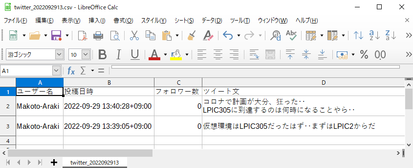

# Inspect06
サンプル検証06 - 口コミ情報をWEB-APIから取得してCSV出力

# 口コミ情報をWEB-API から取得してCSV出力
Twitterから口コミ情報をWEB-APIから取得してCSV出力

 

## 1. Twitter上の口コミ情報を確認

 

## 2. 検索キーワードに「LPIC305」を指定してソース記述
ノートブックファイルを参照

 

## 3. ノートブックファイル実行
口コミ情報のCSV出力が行われる

 

## 4. CSVファイル確認

